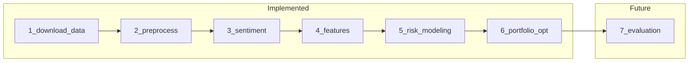
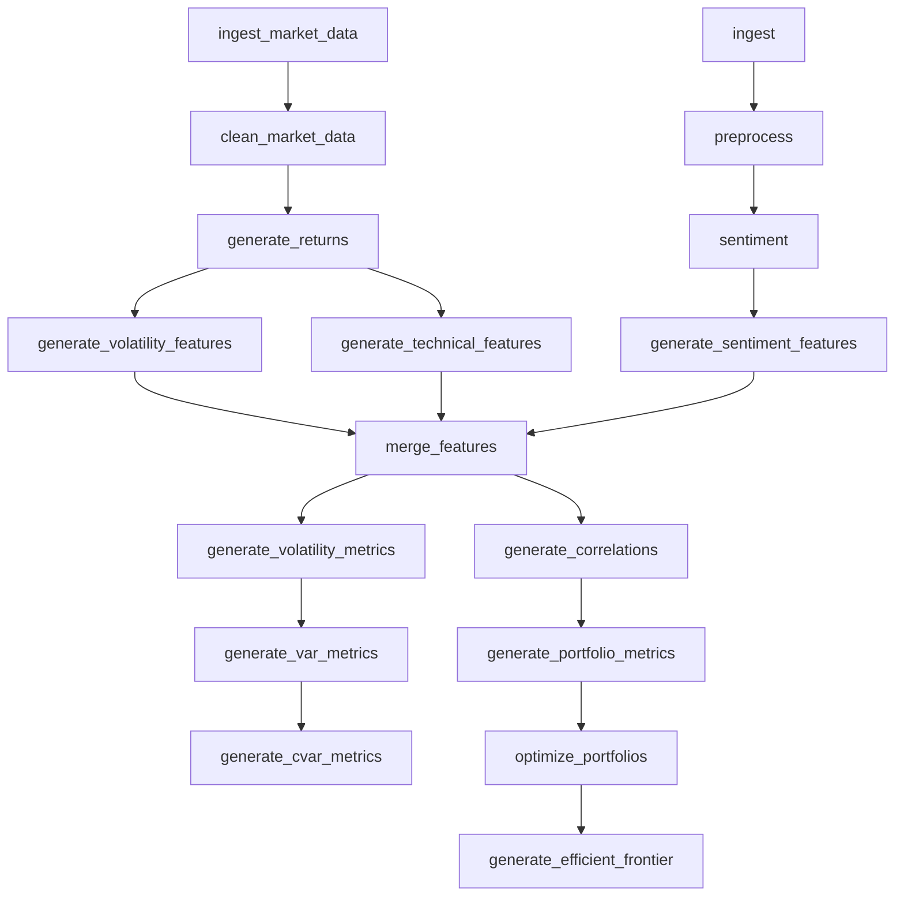

# AI Quant Risk Engine

Institutional-style **financial sentiment + risk modeling** platform for a hedge-fund class project.

- **Phase 1:** FinBERT sentiment pipeline (news → preprocess → sentiment)
- **Phase 2:** Market data lake + lazy Polars feature engineering → `risk_dataset.parquet`
- **Phase 3:** Quantitative risk engine — VaR/CVaR, vol, correlations, Markowitz optimization, efficient frontier

## Pipeline map: 7 conceptual steps vs 17 DVC stages



| Conceptual step | Status | DVC stage(s) |
|-----------------|--------|--------------|
| 1–4 | Done | Phase 1 + Phase 2 (10 stages) |
| 5. Risk modeling | Done | `generate_volatility_metrics`, `generate_var_metrics`, `generate_cvar_metrics`, `generate_correlations` |
| 6. Portfolio optimization | Done | `generate_portfolio_metrics`, `optimize_portfolios`, `generate_efficient_frontier` |
| 7. Evaluation | Partial | DVCLive metrics + `data/analytics/risk/` |

### DVC stage flow



## Features

### Phase 1
- DVC: `ingest` → `preprocess` → `sentiment`
- FinBERT via `transformers.pipeline`

### Phase 2
- Market ingestion (`sample` | `yfinance`)
- Hive-partitioned OHLCV: `data/processed/market/year=YYYY/month=M/`
- Lazy writes via `sink_parquet` (Polars >= 1.20, `PartitionBy`)
- Merged output: `data/features/merged/risk_dataset.parquet`

### Phase 3
- Volatility: rolling, EWMA, regime flags, GARCH
- VaR / CVaR: historical, parametric, Monte Carlo
- Correlation/covariance with Ledoit-Wolf shrinkage
- HMM regimes, portfolio analytics
- Markowitz min-var / max-Sharpe + efficient frontier
- Plotly dashboard: `data/analytics/risk/`

## Project structure

```
ai-quant-risk-engine/
├── configs/              # YAML + schemas/
├── data/
│   ├── raw/market/
│   ├── processed/market/
│   ├── features/
│   ├── risk/
│   └── external/
├── docs/
├── src/
│   ├── ingestion/
│   ├── market/
│   ├── features/
│   ├── sentiment/
│   └── utils/
├── dvc.yaml
└── params.yaml
```

## Setup

**Python 3.12 only** (CI and local dev). Do not use Python 3.14 — many wheels (NumPy, torch) are not ready yet.

```powershell
cd ai-quant-risk-engine
py -3.12 -m venv .venv312
.venv312\Scripts\activate
pip install -e ".[dev,market,risk]"
copy .env.example .env
```

Requires **Polars >= 1.20** for streaming partitioned parquet writes.

Cursor/VS Code picks `.venv312` via [`.vscode/settings.json`](.vscode/settings.json). `pytest` fails fast on the wrong interpreter ([`tests/conftest.py`](tests/conftest.py)).

## Configure tickers and date range

Edit [`params.yaml`](params.yaml) or [`configs/market.yaml`](configs/market.yaml):

```yaml
market:
  source: sample          # or yfinance
  tickers: [AAPL, MSFT, XOM, GS, JPM]
  start_date: "2024-01-01"
  end_date: "2024-03-31"
```

Or per session:

```powershell
$env:MARKET_SOURCE = "yfinance"
dvc repro ingest_market_data clean_market_data
```

Sentiment source → ticker mapping: [`configs/sentiment_map.yaml`](configs/sentiment_map.yaml).

## Run pipelines

```bash
dvc repro
```

Phase 2 only (sample, no network):

```powershell
$env:MARKET_SOURCE = "sample"
dvc repro ingest_market_data clean_market_data generate_returns
dvc repro generate_volatility_features generate_technical_features generate_sentiment_features merge_features
```

Phase 3 risk engine (after `merge_features`):

```powershell
.venv312\Scripts\activate
$env:MARKET_SOURCE = "sample"
dvc repro generate_volatility_metrics generate_var_metrics generate_cvar_metrics
dvc repro generate_correlations generate_portfolio_metrics optimize_portfolios generate_efficient_frontier
```

## DVC remote storage (optional)

**You do not need `dvc push` for local work.** `dvc repro` already stores artifacts in `.dvc/cache` on your machine.

| Approach | When to use |
|----------|-------------|
| **No remote** (default) | Solo / class project; re-run `dvc repro` to regenerate data |
| **Local folder remote** | Practice “real” MLOps without cloud — good simulation on one PC |
| **Cloud remote** (S3, GCS, Azure, SSH) | Team sharing of large artifacts |

There is **no DVC account** to create. DVC is open-source; remotes are just storage locations.

### Local remote (configured)

Artifacts are pushed to a folder **outside the repo** (simulates cloud storage):

`D:\Romain\Projects\Finance\02_Risk Analysis\DVC_test_quant`

Configured in [`.dvc/config`](.dvc/config) as remote `localstore` (default). After `dvc repro`:

```powershell
.venv312\Scripts\activate
dvc push    # upload cache → DVC_test_quant
dvc pull    # restore on another machine / fresh clone
```

### Cloud remote (later)

```powershell
dvc remote add -d myremote s3://my-bucket/path
# or: gs://..., azure://..., ssh://user@host/path
dvc push
```

See [docs/mlops.md](docs/mlops.md) for more detail.

## Testing

```bash
pytest
```

## Documentation

- [Architecture](docs/architecture.md)
- [Data architecture](docs/data_architecture.md)
- [Polars guidelines](docs/polars_guidelines.md)
- [Feature store](docs/feature_store.md)
- [MLOps](docs/mlops.md)
- [Agents guide](docs/agents.md)
- [Roadmap](docs/roadmap.md)
- [Risk models](docs/risk_models.md)
- [Portfolio theory](docs/portfolio_theory.md)
- [Quantitative methods](docs/quantitative_methods.md)
- [Optimization pipeline](docs/optimization_pipeline.md)

## Roadmap

- **Phase 2b:** VaR, GARCH, portfolio optimization in `src/risk` / `src/portfolio`
- **Phase 3:** Private-markets Monte Carlo / quantum research
