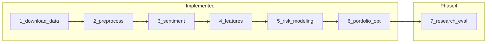
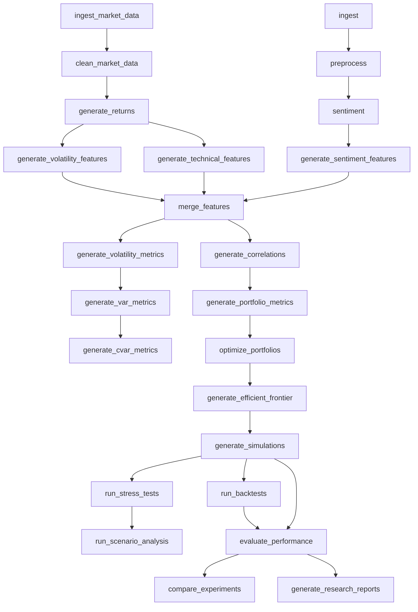

# AI Quant Risk Engine

Institutional-style **financial sentiment + risk modeling** platform for a hedge-fund class project.

- **Phase 1:** FinBERT sentiment pipeline (news → preprocess → sentiment)
- **Phase 2:** Market data lake + lazy Polars feature engineering → `risk_dataset.parquet`
- **Phase 3:** Quantitative risk engine — VaR/CVaR, vol, correlations, Markowitz optimization, efficient frontier
- **Phase 4:** Research engine — Monte Carlo paths, stress/scenarios, backtesting, experiment tracking

## Pipeline map: 7 conceptual steps vs 24 DVC stages



| Conceptual step | Status | DVC stage(s) |
|-----------------|--------|--------------|
| 1–4 | Done | Phase 1 + Phase 2 (10 stages) |
| 5. Risk modeling | Done | `generate_volatility_metrics`, `generate_var_metrics`, `generate_cvar_metrics`, `generate_correlations` |
| 6. Portfolio optimization | Done | `generate_portfolio_metrics`, `optimize_portfolios`, `generate_efficient_frontier` |
| 7. Research & evaluation | Done | `generate_simulations` … `generate_research_reports` |

### DVC stage flow



## Features

### Phase 1
- DVC: `ingest` → `preprocess` → `sentiment`
- FinBERT via `transformers.pipeline`

### Phase 2
- Market ingestion (`sample` | `yfinance`)
- Hive-partitioned OHLCV: `data/processed/market/year=YYYY/month=M/`
- Lazy writes via `sink_parquet` (Polars >= 1.20, `PartitionBy`)
- Merged output: `data/features/merged/risk_dataset.parquet`

### Phase 3
- Volatility: rolling, EWMA, regime flags, GARCH
- VaR / CVaR: historical, parametric, Monte Carlo
- Correlation/covariance with Ledoit-Wolf shrinkage
- HMM regimes, portfolio analytics
- Markowitz min-var / max-Sharpe + efficient frontier (run profile: equal / manual / partial / optimised)
- Plotly dashboard: `data/analytics/risk/`

### Phase 4
- Monte Carlo (GBM, multivariate, regime GBM), stress tests, scenarios
- Backtesting with configurable weight source (`research.backtest_weight_source`)
- Experiment comparison + research HTML dashboard (`generate_research_reports`)

### Phase 5
- Multi-page Streamlit platform, copilot, FastAPI, monitoring, governance reports (`aqre dashboard`, `aqre copilot`, `aqre api`)
- **Signals** sidebar page: FinBERT scores (30d), 3-tranche trailing stops, HMM regime (365d chart), VaR 95% — see [docs/signals_dashboard.md](docs/signals_dashboard.md)
- **Portfolio** page + sentiment-aware optimization (min gross, FinBERT sides, blended μ) — [docs/portfolio_dashboard.md](docs/portfolio_dashboard.md), [docs/run_profile.md](docs/run_profile.md)
- **Tracker** sidebar page: Excel trade ledger, optimal-weight vs actual comparison, performance chart — see [docs/portfolio_tracker.md](docs/portfolio_tracker.md); `aqre tracker ingest`

## Project structure

```
ai-quant-risk-engine/
├── configs/
│   ├── run.yaml          # Local run profile (tickers, demo/live, portfolio)
│   ├── run.ci.yaml       # CI sample profile (GitHub Actions)
│   ├── market.yaml, features.yaml, risk/, schemas/
├── data/                 # Pipeline outputs (mostly gitignored; DVC-tracked)
├── docs/
├── notebooks/            # Exploratory trading notebooks (not the main app)
├── scripts/              # setup_and_run_windows.ps1, setup_and_run_macos_linux.sh
├── src/
│   ├── ingestion/, preprocessing/, sentiment/
│   ├── market/, features/, risk/, portfolio/
│   ├── simulation/, backtesting/, research/
│   ├── analytics/, dashboards/, copilot/, api/, platform/
│   └── utils/
├── tests/
├── dvc.yaml
└── params.yaml           # DVC params (merged with configs/ at runtime)
```

**Language stats on GitHub:** a few notebooks under `notebooks/` with saved Plotly outputs can dominate the “Jupyter” percentage. Production code lives in `src/` (~200+ Python modules).

## Setup

**Python 3.12 only** (CI and local dev). Do not use Python 3.14 — many wheels (NumPy, torch) are not ready yet.

Non-technical users: see [docs/quickstart_nontechnical.md](docs/quickstart_nontechnical.md).

**Configure a run:** edit [configs/run.yaml](configs/run.yaml) (tickers, `demo` vs `live`, portfolio weighting), then:

```powershell
aqre prepare          # holdings + run manifest; validates tickers
aqre run profile      # applies profile env + full dvc repro
# or: aqre run profile --dashboard
```

See [docs/run_profile.md](docs/run_profile.md). CI uses [configs/run.ci.yaml](configs/run.ci.yaml) via `RUN_PROFILE` (sample tickers, pinned dates).

**One-shot bootstrap (Windows / macOS / Linux):**

```powershell
.\scripts\setup_and_run_windows.ps1
# ./scripts/setup_and_run_macos_linux.sh
```

**Manual venv:**

```powershell
cd ai-quant-risk-engine
py -3.12 -m venv .venv312
.venv312\Scripts\activate
pip install -e ".[dev,market,risk,research,dashboard]"
copy .env.example .env
```

Requires **Polars >= 1.20** for streaming partitioned parquet writes.

Cursor/VS Code picks `.venv312` via [`.vscode/settings.json`](.vscode/settings.json). `pytest` fails fast on the wrong interpreter ([`tests/conftest.py`](tests/conftest.py)).

## Interactive dashboard (Streamlit)

Primary UX for exploring charts with a **date slider**, KPI cards, and optional **live yfinance** prices.

```powershell
.venv312\Scripts\activate
pip install -e ".[dashboard,market,research,risk]"
streamlit run src/analytics/streamlit_dashboard.py
```

| Action | Typical time |
|--------|----------------|
| Open dashboard (sample parquet) | &lt; 1–3 s |
| Move date slider / change chart | 1–3 s |
| Background yfinance (5 tickers, ~1Y) | ~15–45 s |
| Full `dvc repro` + sentiment | 10–30+ min |

- **Sample (default):** reads local DVC artifacts under `data/`.
- **Live:** background fetch to `data/cache/market_live/` (gitignored); button enables when ready. Risk/backtest metrics still come from the last sample pipeline run.

If live fetch fails with *"yfinance returned no data"*, upgrade and retry:

```powershell
pip install -U "yfinance>=1.3.0" "curl_cffi>=0.15"
```

Yahoo often blocks plain HTTP clients; `curl_cffi` mimics a browser. Also check DNS/network access to `fc.yahoo.com`, then use **Retry live fetch** in the sidebar.

Live fetch tries several Yahoo client strategies automatically (including a no-verify SSL fallback for common Windows curl cert issues). For stricter SSL, set `$env:YFINANCE_SSL_VERIFY = "1"` only. To prefer no-verify first (dev): `$env:YFINANCE_SSL_VERIFY = "0"`.

Static export (reports/CI): `data/analytics/dashboard/index.html` after `generate_research_reports`.

### Refresh sample data to ~1 year

After enabling rolling dates in config, run market + downstream stages once:

```powershell
$env:MARKET_SOURCE = "sample"
# Local dev uses rolling window (end=today, start=today-365d) unless MARKET_PIN_DATES=1
dvc repro ingest_market_data clean_market_data generate_returns merge_features
# Add risk + research stages as needed (FinBERT sentiment is the slow step)
```

Until repro completes, the slider clamps to whatever exists on disk (e.g. 2024 Q1) with a banner in the app.

## Configure tickers and date range

**Preferred:** [configs/run.yaml](configs/run.yaml) (merged into app config; drives `aqre prepare` and ingest).

**Legacy / DVC params:** [`params.yaml`](params.yaml) or [`configs/market.yaml`](configs/market.yaml):

```yaml
market:
  source: sample          # or yfinance
  tickers: [AAPL, MSFT, XOM, GS, JPM]
  use_rolling_window: true   # end=today, start=today-rolling_days
  rolling_days: 365
  # Pin for CI / reproducibility:
  # use_rolling_window: false
  # start_date: "2024-01-01"
  # end_date: "2024-03-31"
```

Or per session:

```powershell
$env:MARKET_SOURCE = "yfinance"
dvc repro ingest_market_data clean_market_data
```

Sentiment source → ticker mapping: [`configs/sentiment_map.yaml`](configs/sentiment_map.yaml).

## Phase 5 — Portfolio intelligence platform

Institutional dashboard, copilot, API, monitoring, and reports on top of Phases 1–4.

```powershell
pip install -e ".[dashboard,platform,risk,research]"
aqre dashboard                    # multi-page platform UI
aqre dashboard --legacy           # Phase 4 chart explorer
aqre copilot ask "Which assets contribute most to VaR?"
aqre api serve                    # FastAPI on :8000
aqre workflow run platform_reports
dvc repro generate_platform_reports
```

| Component | Location |
|-----------|----------|
| Platform dashboard | `src/dashboards/app.py` + `pages/` |
| Signals (FinBERT, stops, regime, VaR) | `src/dashboards/pages/7_Signals.py` — [docs](docs/signals_dashboard.md) |
| Tracker (Excel trades, positions, charts) | `src/dashboards/pages/8_Tracker.py` — [docs](docs/portfolio_tracker.md) |
| Copilot | `src/copilot/` |
| REST API | `src/api/` |
| Monitoring | `src/monitoring/` |
| Reports | `reports/` (generated) |
| Docs | `docs/system_architecture.md`, `docs/copilot_architecture.md`, … |

## CLI (`aqre`)

After `pip install -e ".[dev]"`, use the unified CLI for common workflows:

```powershell
aqre config show
aqre prepare [--profile configs/run.yaml]
aqre run profile [--dashboard] [--pin-dates]
aqre run phase2 --market-source sample
aqre run phase3 --market-source sample --dry-run
aqre run stage merge_features
aqre run all
aqre dashboard              # Phase 5 platform UI
aqre dashboard --legacy     # Phase 4 chart explorer
```

| Variable | Purpose |
|----------|---------|
| `RUN_PROFILE` | Path to run YAML (CI: `configs/run.ci.yaml`) |
| `MARKET_SOURCE` | `sample` or `yfinance` (plain `dvc repro`; profile commands override when using `aqre run profile`) |
| `MARKET_PIN_DATES` | `1` = use pinned `start_date` / `end_date` (CI) |
| `NEWS_SOURCE` | `sample` or `yfinance` (`aqre run profile` sets from `mode`; live needs `pip install -e ".[market]"`) |

Holdings under `data/raw/portfolio/holdings.parquet` are refreshed automatically when tickers no longer match the active profile (e.g. after switching from local `run.yaml` to CI tickers).

## Run pipelines

```bash
dvc repro
```

Phase 2 only (sample, no network):

```powershell
$env:MARKET_SOURCE = "sample"
dvc repro ingest_market_data clean_market_data generate_returns
dvc repro generate_volatility_features generate_technical_features generate_sentiment_features merge_features
```

Phase 3 risk engine (after `merge_features`):

```powershell
.venv312\Scripts\activate
$env:MARKET_SOURCE = "sample"
dvc repro generate_volatility_metrics generate_var_metrics generate_cvar_metrics
dvc repro generate_correlations generate_portfolio_metrics optimize_portfolios generate_efficient_frontier
```

## DVC remote storage (optional)

**You do not need `dvc push` for local work.** `dvc repro` already stores artifacts in `.dvc/cache` on your machine.

| Approach | When to use |
|----------|-------------|
| **No remote** (default) | Solo / class project; re-run `dvc repro` to regenerate data |
| **Local folder remote** | Practice “real” MLOps without cloud — good simulation on one PC |
| **Cloud remote** (S3, GCS, Azure, SSH) | Team sharing of large artifacts |

There is **no DVC account** to create. DVC is open-source; remotes are just storage locations.

### Local remote (configured)

Artifacts are pushed to a folder **outside the repo** (simulates cloud storage):

`D:\Romain\Projects\Finance\02_Risk Analysis\DVC_test_quant`

Configured in [`.dvc/config`](.dvc/config) as remote `localstore` (default). After `dvc repro`:

```powershell
.venv312\Scripts\activate
dvc push    # upload cache → DVC_test_quant
dvc pull    # restore on another machine / fresh clone
```

### Cloud remote (later)

```powershell
dvc remote add -d myremote s3://my-bucket/path
# or: gs://..., azure://..., ssh://user@host/path
dvc push
```

See [docs/mlops.md](docs/mlops.md) for more detail.

## Continuous integration (GitHub Actions)

Workflow: [`.github/workflows/ci.yml`](.github/workflows/ci.yml) on `main` / `master` / `Romain_Tracking_step`.

| Step | What runs |
|------|-----------|
| `pytest -q` | Full test suite (`dev,market,risk,research,dashboard` extras) |
| DVC Phase 1 | `ingest`, `preprocess` |
| DVC Phase 2+ | Sample market → features → merge → risk metrics → research reports |
| Smoke check | `data/analytics/dashboard/index.html` exists |

CI environment:

```yaml
MARKET_SOURCE: sample
MARKET_PIN_DATES: "1"
RUN_PROFILE: configs/run.ci.yaml
```

**Do not commit generated pipeline metrics** under `metrics/sentiment/`, `metrics/research_*/`, or `metrics/platform/` — DVC owns those outputs. They are gitignored; if they were ever committed on `main`, remove with `git rm -r --cached metrics/<path>`.

## Testing

```bash
pytest
# Phase 5 platform smoke (copilot, API, reports, monitoring):
pytest tests/test_phase5_integration.py tests/test_copilot_explanations.py -v
```

Requires **Python 3.12** (see [`tests/conftest.py`](tests/conftest.py)).

## Notebooks

Exploratory workflows only — canonical pipeline code is under `src/`.

| Notebook | Notes |
|----------|--------|
| `notebooks/trading_risk_manager_final.ipynb` | Latest trading / risk demo |
| `notebooks/trading_risk_manager_v*.ipynb` | Older iterations (large if outputs saved) |
| `notebooks/trading_notebook_utils.py` | Shared helpers (ported into `src/portfolio/`) |

Align a notebook run with the pipeline by copying values from [configs/run.yaml](configs/run.yaml). Clear saved outputs before commit if you want smaller diffs (`jupyter nbconvert --clear-output --inplace notebooks/*.ipynb`).

## Documentation

Full index: [docs/README.md](docs/README.md)

### Getting started

- [Quickstart (non-technical)](docs/quickstart_nontechnical.md)
- [Run profile](docs/run_profile.md) — `configs/run.yaml`, `aqre prepare`, weighting modes
- [Roadmap](docs/roadmap.md)

### Architecture & data

- [Architecture](docs/architecture.md)
- [Data architecture](docs/data_architecture.md)
- [Feature store](docs/feature_store.md)
- [Polars guidelines](docs/polars_guidelines.md)

### Risk & portfolio (Phase 3)

- [Risk models](docs/risk_models.md)
- [Portfolio theory](docs/portfolio_theory.md)
- [Quantitative methods](docs/quantitative_methods.md)
- [Optimization pipeline](docs/optimization_pipeline.md)

### Research (Phase 4)

- [Research framework](docs/research_framework.md)
- [Simulation architecture](docs/simulation_architecture.md)
- [Backtesting methodology](docs/backtesting_methodology.md)
- [Experiment tracking](docs/experiment_tracking.md)
- [Experimentation (how-to)](docs/experimentation.md)

### Platform (Phase 5)

- [Signals dashboard](docs/signals_dashboard.md) — FinBERT, trailing stops, regime, VaR
- [System architecture](docs/system_architecture.md)
- [Copilot architecture](docs/copilot_architecture.md)
- [Decision engine](docs/decision_engine.md)
- [Model serving (API)](docs/model_serving.md)
- [Observability](docs/observability.md)
- [MLOps governance](docs/mlops_governance.md)

### Engineering

- [MLOps](docs/mlops.md) — DVC, CI, remotes, metrics
- [Agents guide](docs/agents.md) — conventions for AI / contributors

## Roadmap

See [docs/roadmap.md](docs/roadmap.md) for current backlog. Phases 1–5 (sentiment → market features → risk engine → research → platform dashboard/copilot/API) are implemented in this repo; future work includes live news ingestion and extended private-markets research.
