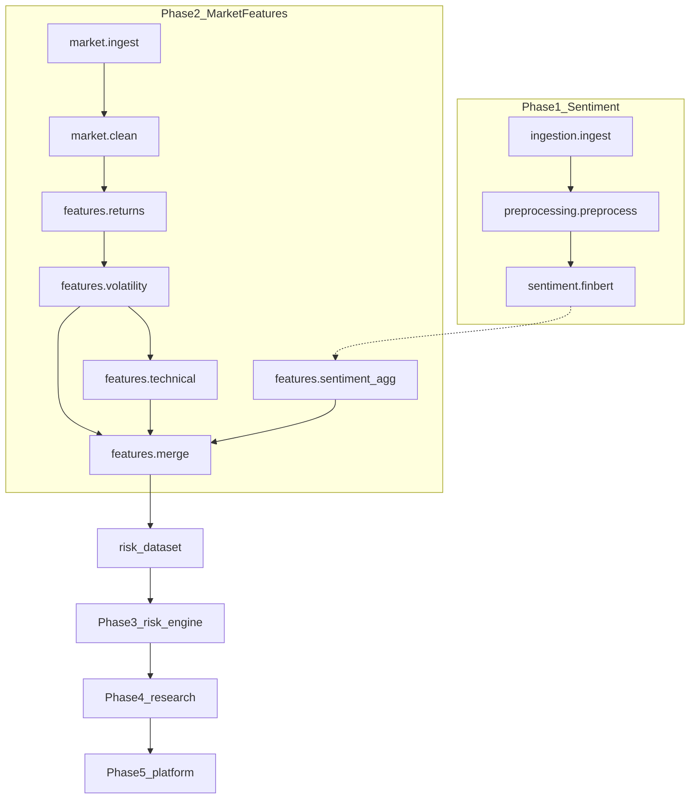

# Architecture

## Overview

The AI Quant Risk Engine separates **exploration** (notebooks) from **production** (`src/`). Phases 1–2 cover sentiment and market features; Phases 3–5 add risk modeling, research/backtesting, and the platform dashboard/copilot/API. Configure runs via [run_profile.md](run_profile.md) (`configs/run.yaml`).

## Modules

| Package | Responsibility |
|---------|----------------|
| `src.ingestion` | `sample` + `yfinance` news adapters (extensible registry) |
| `src.preprocessing` | News cleaning → canonical `text` |
| `src.sentiment` | FinBERT inference |
| `src.market` | OHLCV ingest, clean, partitioned parquet lake, ticker validation |
| `src.features` | Returns, volatility, technical, sentiment agg, merge |
| `src.schemas` | Column contracts |
| `src.validation` | Schema checks |
| `src.risk` | VaR, vol, regimes, optimization, portfolio metrics |
| `src.portfolio` | Run profile → holdings (`prepare.py`, `weights.py`) |
| `src.simulation` / `src.backtesting` / `src.research` | Phase 4 Monte Carlo, stress, backtests, reports |
| `src.dashboards` / `src.copilot` / `src.api` / `src.platform` | Phase 5 UI, Q&A, REST, reports |

## Data schemas (summary)

| Dataset | Key columns |
|---------|-------------|
| Market (clean) | `timestamp`, `ticker`, `open`, `high`, `low`, `close`, `volume` |
| Market (features) | + `returns`, `log_returns`, `volatility`, `rolling_sharpe`, … |
| Sentiment agg | `timestamp`, `ticker`, `confidence`, `bullish_ratio` |
| Risk dataset | Join on `timestamp`, `ticker` |

Full definitions: [`configs/schemas/`](../configs/schemas/) and [data_architecture.md](data_architecture.md).

## Partitioning

`data/processed/market/year=YYYY/month=MM/*.parquet`

## Technology

- **Polars** LazyFrame-first ([polars_guidelines.md](polars_guidelines.md))
- **Parquet** + zstd compression
- **DVC** reproducible stages
- **Hugging Face** FinBERT (Phase 1)
- **yfinance** optional market source (pandas boundary in adapter only)

## Phase boundaries

| Phase | Scope |
|-------|--------|
| 1 | News sentiment |
| 2 | Market lake + feature store + `risk_dataset` |
| 3 | Risk models + portfolio optimization |
| 4 | Monte Carlo, stress/scenarios, backtesting, research dashboards |
| 5 | Platform dashboard, copilot, API, monitoring, governance reports |

See also [research_framework.md](research_framework.md) (Phase 4), [system_architecture.md](system_architecture.md) (Phase 5), [roadmap.md](roadmap.md), and the full [docs index](README.md).
