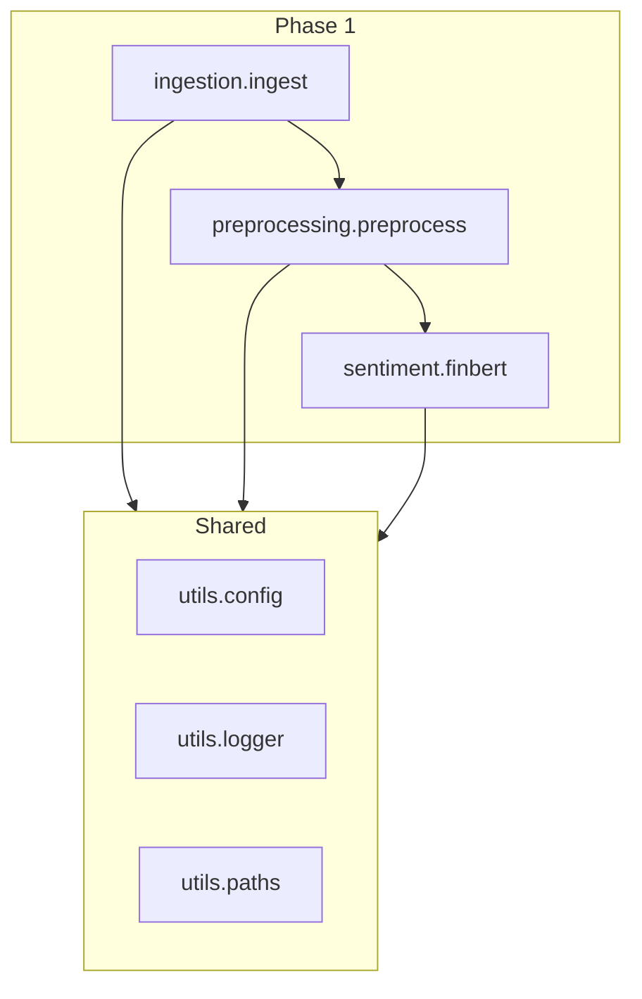

# Architecture

## Overview

The AI Quant Risk Engine separates **exploration** (notebooks) from **production** (`src/`). Phase 1 implements a linear data pipeline for financial news sentiment.

## Modules

| Package | Responsibility |
|---------|----------------|
| `src.ingestion` | Load or generate raw financial news (CSV) |
| `src.preprocessing` | Clean text, canonical `text` column, Parquet output |
| `src.sentiment` | FinBERT inference, sentiment columns, DVCLive metrics |
| `src.utils` | Paths, YAML config merge, structured logging |
| `src.risk` | Phase 2 – VaR, GARCH, regime models |
| `src.portfolio` | Phase 2 – optimization, constraints |
| `src.visualization` | Phase 2 – reports and charts |

## Data flow

1. **Raw**: `data/raw/news.csv` – columns `date`, `source`, `title`, `content`
2. **Processed**: `data/processed/news.parquet` – adds canonical `text` (trimmed, non-empty)
3. **Sentiment**: `data/processed/sentiment.parquet` – adds `sentiment_label`, `sentiment_score`
4. **Metrics**: `metrics/sentiment/metrics.json` – DVCLive (`avg_positive_score`, `total_rows`)

## Technology choices

- **Polars**: columnar, fast I/O; used for all `src/` tabular work
- **Parquet**: compressed columnar storage for processed artifacts
- **Hugging Face Transformers**: FinBERT sentiment pipeline
- **DVC**: reproducible stages, parameter and output tracking
- **DVCLive**: metrics logging (`save_dvc_exp=False` to avoid experiment stash issues on Windows)

## Phase boundaries

| Phase | Scope |
|-------|--------|
| 1 | Ingest → preprocess → FinBERT sentiment |
| 2 | Market data, risk metrics, portfolio in `src/` |
| 3 | Private-markets Monte Carlo research |

Notebooks under `notebooks/` may prototype Phase 2 logic but must not become the production entry point.
