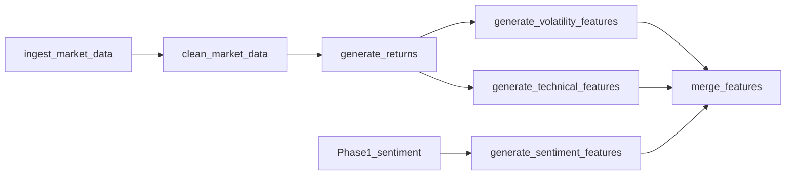

# Data Architecture (Phase 2)

## Overview

The platform uses a **parquet-first data lake** with Hive-style partitioning for time-series market data. Phase 1 sentiment artifacts remain compatible; Phase 2 adds market ingestion and feature stores.

## Directory layout

```
data/
├── raw/
│   ├── news.csv                 # Phase 1 (migrate to parquet in stretch)
│   └── market/                  # Raw landing from ingest
├── processed/
│   ├── news.parquet
│   ├── sentiment.parquet
│   └── market/                  # Cleaned OHLCV
│       └── year=YYYY/month=MM/*.parquet
├── features/
│   ├── returns/
│   ├── volatility/
│   ├── technical/
│   ├── sentiment_agg/
│   └── merged/
│       ├── risk_dataset.parquet
│       └── _metadata.json
├── external/
│   └── sample_market/           # Bundled CI sample
└── analytics/                   # Plotly / summary exports
```

## Schemas

| Dataset | Location | Join keys |
|---------|----------|-----------|
| Market (clean) | `processed/market/` | `timestamp`, `ticker` |
| Returns | `features/returns/` | `timestamp`, `ticker` |
| Volatility | `features/volatility/` | `timestamp`, `ticker` |
| Technical | `features/technical/` | `timestamp`, `ticker` |
| Sentiment agg | `features/sentiment_agg/` | `timestamp`, `ticker` |
| Risk dataset | `features/merged/risk_dataset.parquet` | `timestamp`, `ticker` |

YAML definitions: [`configs/schemas/`](../configs/schemas/).

## Partitioning

- **Keys:** `year`, `month` (derived from `timestamp`)
- **Path:** `data/processed/market/year=2024/month=01/part-*.parquet`
- **Compression:** `zstd` (configurable in `configs/market.yaml`)

## Ingestion modes

| Mode | Use case |
|------|----------|
| `sample` | CI, offline tests, no network |
| `yfinance` | Local reproduction with live downloads |

Set via `params.yaml` → `market.source` or environment variable `MARKET_SOURCE`.

## Lineage


