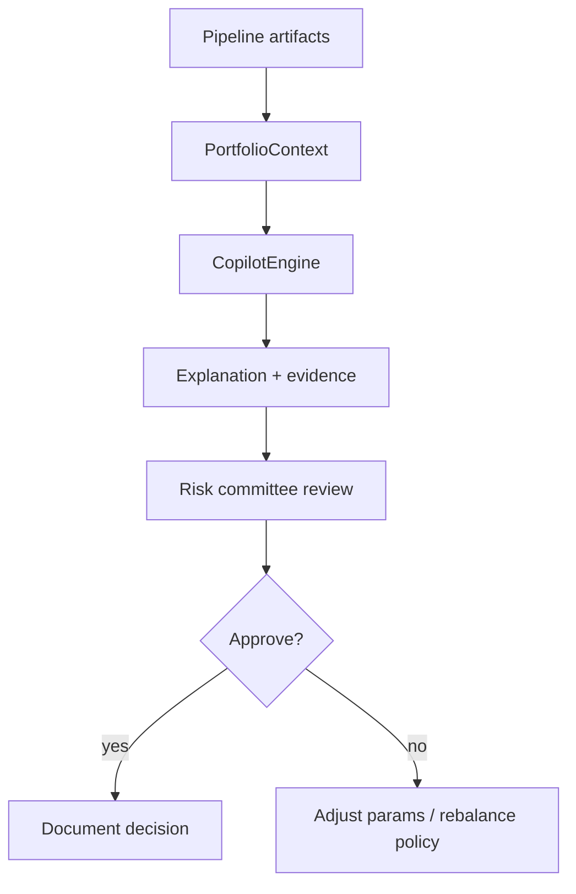

# Decision engine

## Principles

1. **Assist, not automate** — no order execution.
2. **Evidence-backed** — every answer includes artifact-derived evidence.
3. **Uncertainty visible** — confidence levels and human-review flags.
4. **Reproducible** — tied to `experiment_id` and DVC params.

## Decision workflow

## Outputs used in decisions

| Output | Use |
|--------|-----|
| VaR / CVaR tables | Tail risk limits |
| Regime labels | Scenario selection |
| Backtest equity | Historical policy check |
| Stress metrics | Committee stress pack |
| Copilot brief | Narrative for PM / risk |

## Non-goals (Phase 5 MVP)

- Automated trading
- Real-time order management
- Black-box LLM-only answers without evidence
