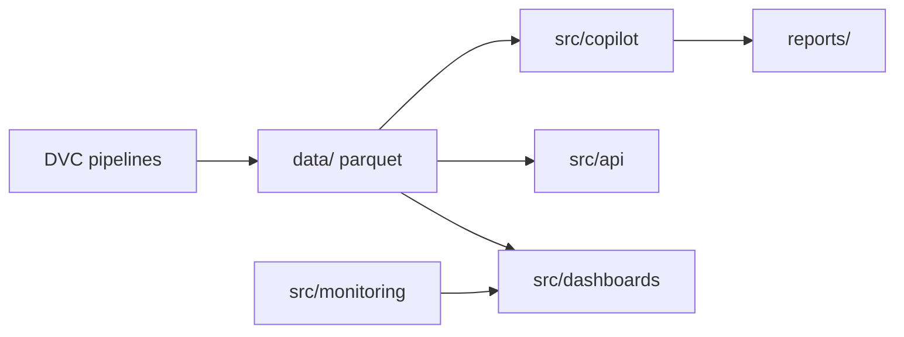

# System architecture (Phase 5)

## Platform layers

| Layer | Packages | Responsibility |
|-------|----------|----------------|
| Data plane | `src/market`, `src/features`, DVC | Reproducible parquet artifacts |
| Analytics plane | `src/risk`, `src/simulation`, `src/backtesting` | Quant models |
| Intelligence plane | `src/copilot` | Decision support, explanations |
| Presentation | `src/dashboards`, `src/analytics` | Human interfaces |
| Serving | `src/api` | REST APIs for portfolio/risk/copilot |
| Observability | `src/monitoring` | Health, quality, drift, alerts |
| Orchestration | `src/orchestration`, DVC | Scheduled / bundled workflows |
| Reporting | `src/platform/reporting`, `reports/` | Institutional markdown outputs |

## Service boundaries

- **Copilot** reads artifacts only; never mutates positions or executes trades.
- **API** is stateless; sources truth from parquet on disk.
- **Dashboards** are read-only views + copilot Q&A.
- **DVC** remains the system of record for lineage and reproducibility.

## Data flow

## Deployment philosophy

- Local-first: `.venv312`, sample data, optional yfinance.
- Run configuration: [configs/run.yaml](../configs/run.yaml) + `aqre prepare` / `aqre run profile` ([run_profile.md](run_profile.md)).
- No mandatory cloud LLM; copilot is rule-based with optional prompt templates for future LLM wiring.
- Human-in-the-loop on every recommendation.
